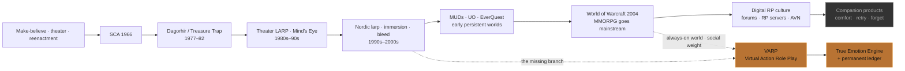

# SlushTec

**Tucson, Arizona · Indie game studio**

Adult interactive worlds with permanent consequences.

We build systems where the street remembers what you did — and the characters carry it. Not chatbots with furniture. Living reactive spaces: free-form action, durable ledgers, relationships that rise *or* collapse, and a world clock that does not wait for you to log back in.

Desert metal. Copper and black. Still forging.

---

## The VARP lineage — why this was always next

Live Action Role Play did not appear from nowhere. Neither does **VARP**.

For fifty years the hobby kept asking the same question: *Can I step into the story instead of only describing it?* Each era answered with the tools it had. The body. The field. The rulebook. The manifesto. The persistent digital world. The chat window.

The chat window was a detour — not the destination.

### Timeline

| Era | What humans built | What it still couldn’t do at scale |
|-----|-------------------|-------------------------------------|
| **Before 1966** | Play-fighting, persona, improv, ritual | Shared persistent rules across strangers |
| **1966+** | SCA — costume, combat, “I am this person” | Fantasy law beyond historical play |
| **1977–82** | **Dagorhir**, **Treasure Trap**, live D&D — LARP as *you are there* | Always-on world; NPCs that aren’t other players |
| **1980s–90s** | Theater LARP, **Mind’s Eye Theatre** | Continuous campaign without logistics walls |
| **1990s–2000s** | **Nordic larp** — immersion, 360°, bleed, no soft story | Accessible daily play; durable digital agents |
| **1990s–early 2000s** | **MUDs**, **Ultima Online**, **EverQuest** — persistent multiplayer worlds | Mainstream reach; readable social consequence for millions |
| **2004+** | **World of Warcraft** — the title that made the **MMORPG** a cultural default | Free-form *authored* NPC depth; permanent personal consequence without grind theater |
| **2000s–2010s** | RP servers, forums, scripted AVNs — digital roleplay culture at scale | Agents that bruise; a ledger that is not just gear and rank |
| **2020s** | LLM “companions” | Weight. Memory that bruises. A street that keeps receipts |
| **Now** | **VARP** — Virtual Action Role Play | *This* is the line that should have been drawn when the models arrived |

### Credit where due — the WoW step

Before language models, the largest proof that people would **live inside a digital world** was the MMORPG — and **World of Warcraft (2004)** was the breakout that taught a generation the grammar of immersion online.

It did not invent persistent worlds alone (**Ultima Online**, **EverQuest**, and MUDs before them carried the torch). What WoW did was make that grammar **default**:

- The world runs while you are offline  
- Reputation, faction, and social standing are real pressures  
- Other players are witnesses — not an audience you can soft-delete  
- “I have a character there” became ordinary speech  

That is a direct ancestor of VARP’s promise: **an always-on space that keeps score**.  
What WoW (and the genre it crowned) still could not give at scale was **LARP-grade free-form action against deep, biased NPCs** — the street that remembers *you*, not only your gear score.

We stand on that shoulder. We do not pretend the companion chatbot invented digital presence.

### The inevitability argument

1. **LARP proved the demand** — people will drive hours, sleep in fields, and risk awkwardness for *embodied* consequence.  
2. **Tabletop proved the systems** — characters, resolution, campaign continuity.  
3. **Nordic theory proved the ambition** — immersion and emotional truth are design goals, not accidents.  
4. **MUDs / UO / EverQuest proved persistence** — the world can outlast a session.  
5. **World of Warcraft proved the mainstream** — millions will treat a digital world as a second place they *have a life in*.  
6. **Language models proved the missing NPC** — reactive agents that can speak in a world’s voice.  

What almost nobody did was **put 1–6 back together**:  
**free-form action + permanent score + world law + agents that form bias instead of forgetting.**

Instead the market optimized the easiest product: *comfort chat*. Reload the bad line. Affection that only climbs. A world that resets when you close the tab.

That is not the evolution of LARP. That is LARPing’s shadow — the version that kept the costume and sold the spine for spare parts.

**VARP** is the claim that the spine was the point.

**True Emotion Engine** is the claim that NPCs should carry residue the way people do — not eidetic transcripts, **bias**. Personality is a trajectory under temperament caps. Illusion of free will is the design target; a full mind is not. V2 ships with Ashcourt; V3 social residual (BondNotice, absence) is near-ready by Pawprint.

If this feels obvious in hindsight, good.  
Obvious things are often the ones an industry walks past for a decade.

*Where the hell was this all these years?*  
In the field. In the manifestos. In Azeroth. In the ledger we refused to soft-delete.  
We’re forging it in Tucson.

---

## What sets us apart

Most “AI companion” and adult VN products optimize for comfort, infinite retry, and affection on demand. We don’t.

| Others often ship | SlushTec ships |
|-------------------|----------------|
| Chat with a character | **Act** inside a reactive mini-universe |
| Soft reset / reload the bad choice | **Permanent ledger** — fail forward, no paid undo |
| One-way affection that only climbs | **Bidirectional** trust and intimacy that can collapse |
| Generic helpful NPC voice | **World-pack authenticity** — realm rules, not customer service |
| Scripted trees or forgetful sessions | **VARP Engine** + **True Emotion Engine** — bias, residue, schema trajectory, durable state |
| Agenda-shaped content checklists | **Worlds, not agendas** — play any adult path the world allows |
| Cloud-only dependency | **Local-first** (optional cloud for art / Avatar Lab) |
| Franchise skin over a chatbot | **Original IP** world packs on a shared engine |

**VARP** is not “virtual roleplay” as a chat genre. It is **Virtual Action Role Play** — closer to LARP than to a dating sim: your choices write the world, NPCs form biases instead of total recall, and the same action does not farm infinite reward.

If you want a vending machine for affection, we are the wrong studio. If you want weight, memory, and a street that keeps receipts — you’re in the right place.

---

## What we make

| Project | What it is | Status |
|---------|------------|--------|
| **[VARP](https://github.com/SlushTec/varp)** | Virtual Action Role Play — a Virtual LARP engine with permanent memory, modular original World Packs, and bidirectional relationships | Active development |
| **[Ashcourt](https://github.com/SlushTec/ashcourt)** | *Hell Rises* — original-IP dark fantasy narrative aRPG; also the flagship World Pack for VARP | Parallel track |

**Original IP only.** No third-party franchise dependence in commercial builds. Local-first compute (optional cloud), cross-save between desktop and mobile where the product supports it.

Future packs expand the same engine — same mechanics, different worlds, different rules of reality.

---

## Design pillars (studio-wide)

1. **Permanent score** — Actions write durable state. The world does not soft-reset because the player regrets a choice.
2. **Fail forward** — No paid undo. No ad-wall retry. Continue is the same life.
3. **True emotion / true consequence** — NPCs form biases, not total recall. Intimacy is earned, bidirectional, and never guaranteed.
4. **World-pack authenticity** — Reactions obey the loaded realm’s internal rules, not generic helpfulness.
5. **Worlds, not agendas** — No culture-war identity terms as design axes. Players may play any adult path the world allows.
6. **Minors: hard no** — Non-negotiable across every title.

---

## Audience

**18+** for adult titles. Comic-Con / dark fantasy / adult VN / serious roleplay demographic. People who want immersion and weight, not a vending machine for affection.

---

## Repositories

Most studio work is **private** during development. Public surfaces will open when a title is ready to ship or document in the open.

| Repo | Notes |
|------|--------|
| [varp](https://github.com/SlushTec/varp) | Engine + Ashcourt vertical slice |
| [ashcourt](https://github.com/SlushTec/ashcourt) | Hell Rises game track |
| [.github](https://github.com/SlushTec/.github) | This profile and org health files |

---

## Contact

**Owner:** [Brian Slusher](https://github.com/bjslusher) · Tucson, AZ  
**Studio:** SlushTec · [slushtec.com](https://slushtec.com)

For press or partnership inquiries, use the channels listed on the owner profile or product pages when they go live.

---

*Built under a hard sun.*
